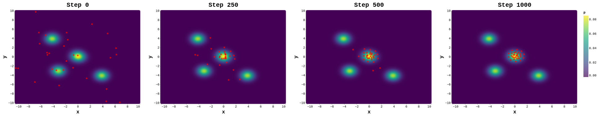

# Stochastic Multiple Target Sampling Gradient Descent 
This repository contains the Pytorch implementation of [Stochastic Multiple Target Sampling Gradient Descent](https://arxiv.org/abs/2206.01934). 




If you find our code useful in your research, please cite:

```
@article{phan2022stochastic,
  title={Stochastic Multiple Target Sampling Gradient Descent},
  author={Phan, Hoang and Tran, Ngoc and Le, Trung and Tran, Toan and Ho, Nhat and Phung, Dinh},
  journal={Advances in Neural Information Processing Systems},
  year={2022}
}
```

### Our implementation consists of 4 subexperiments:
- [CelebA](celeba)
- [Multi-MNIST/Fashion/Fashion and MNIST](multi-mnist)
- [Multivariate Regression](sarcos)
- [Toy example](toy)

### Data:
- [CelebA](https://drive.google.com/file/d/14y2rql9moIhDV4FFLbncnQR2A_CBefzT/view?usp=sharing)
- [Multi-MNIST/Fashion/Fashion and MNIST](https://drive.google.com/drive/folders/1VnmCmBAVh8f_BKJg1KYx-E137gBLXbGG)
- [Multivariate Regression](http://gaussianprocess.org/gpml/data/)

### Reproducing:
Please refer to the bash script (*.sh) in each experiment to reproduce the reported results in the paper.

For the running time of our approach, you can take a look at this notebook in [Google Colab](https://colab.research.google.com/drive/1WiuK6JjFGMWqX3XqWkKZxOfHfMLvFAL1?usp=sharing) as we wanted to utilize the cloud computing service for a fair comparison.

### Contact

If you have any questions about the paper or the codebase, please feel free to contact phanviethoang1512@gmail.com.